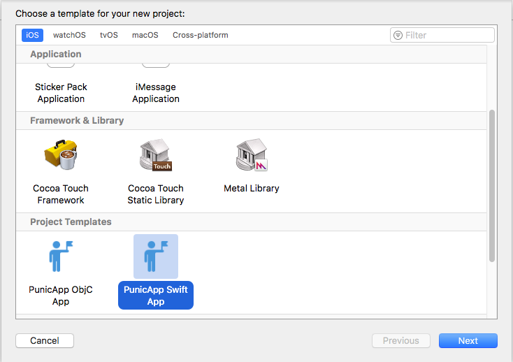
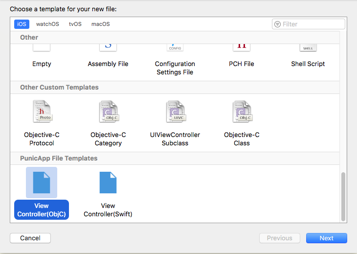

## Installation

To install or update the templates in Xcode:

- Clone or download this repository

- On the command line, `cd` into the `ProjectTemplate` directory and run `./install.sh`

- Launch Xcode and create a new project. Confirm you see a Project Templates category under iOS, as seen below.

- Also you can use file templates. Confirm you see a PunicApp File Templates category after pressed `New File...` , as seen below.

## Version history

* 1.x: works with Swift 3 in Xcode 8
