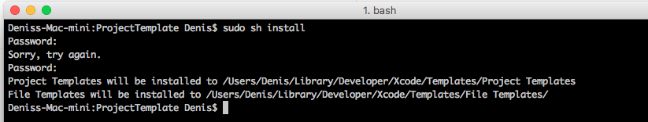
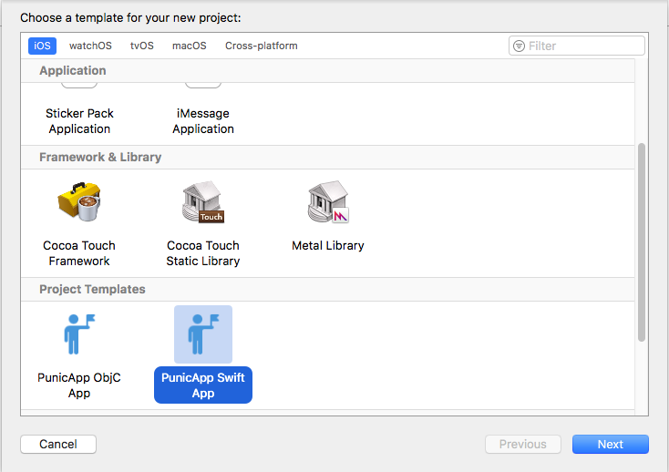

## Installation

To install or update the templates in Xcode:

- Clone or download this repository

- On the command line, `cd` into the `ProjectTemplate` directory and run `./install.sh`

- Launch Xcode and create a new project. Confirm you see a Project Templates category under iOS, as seen below.

After running script project and file templates will be installed in ~/Library/Developer/Xcode/Templates directory.
